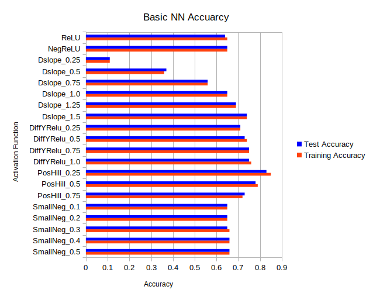

# custom_act_funcs
After investigating ReLU as well as other activation functions I got curious and decided to make some of m own activation functions. In particular I was interested in the linearity of ReLU that allowed for better gradient propagation than a lot of other activation functions like tanh or sigmoid.

All this code was done in python using pytorch

In order to make comparisons to ReLU I needed to use them in Neural Networks(NN), so I have some very simple NNs which I trained on the FashionMNIST dataset. The first NN was a very simple sequential model with 3 linear layers and the same activation function in between these layers. The 2nd model had a 2D conv layer and then two linear layers with the same activation function after each layer amd a final linear layer for the final output. The other 3 models I used were variatins of a ResNet style network, with the residual connections however they weren't as deep as a typical ResNet model. One of these ResNet-like models had BatchNormalization layers, while one did not have any BatchNormalization, and the 3rd one didn't have any residual connections or BatchNormalization layers.

The results from these tests are simply the overall accuracy of the Neural Network on the training dataset and the test dataset. The results are available in the results folder as .csv and .ods files. For each activation function I trained 5 NNs to get an average result and also only trained each NN for 5 epochs. The average results for the final epochs for each activation function are  described in the following bar charts.

# TODO:
* Add results for rest of tests
* Redo hill functions to be better implemented:
  * Could do it with boolean masks and then zip them together to make one big tensor that I will only have to iterate once
* One of my hill functinos is giving me an error "expected scalar type float but found long int" so hopefully redoing the hill functions will solve that error
* Remove the clone step from my activation functions and thus the inplace functionality, I didn't implement it correctly the first time and it's probabaly not worth the effort as doing things inplace can cause errors with backpropagation
